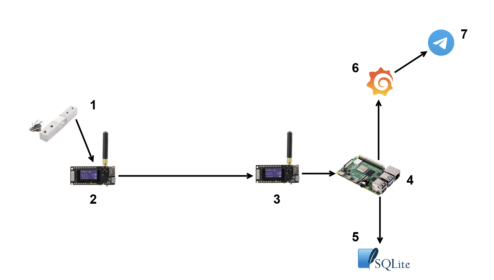
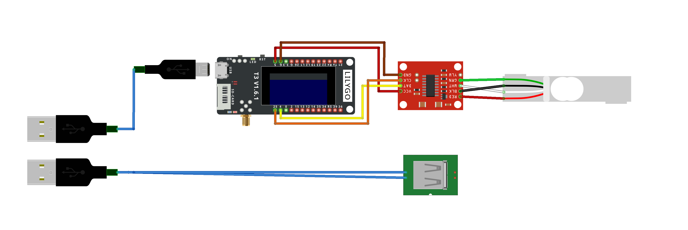
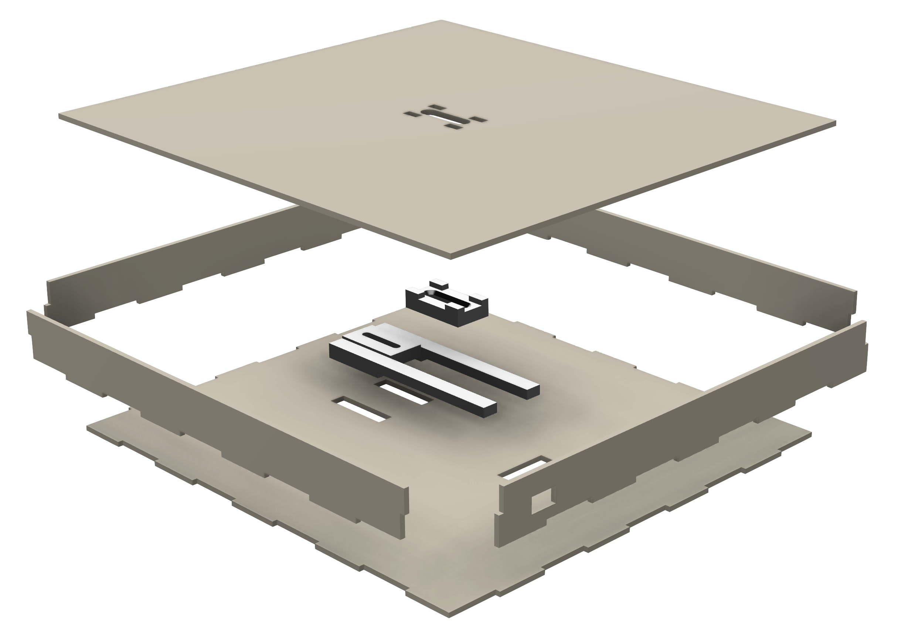
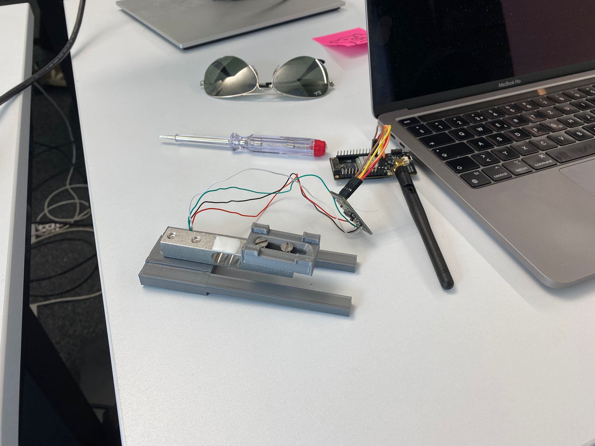
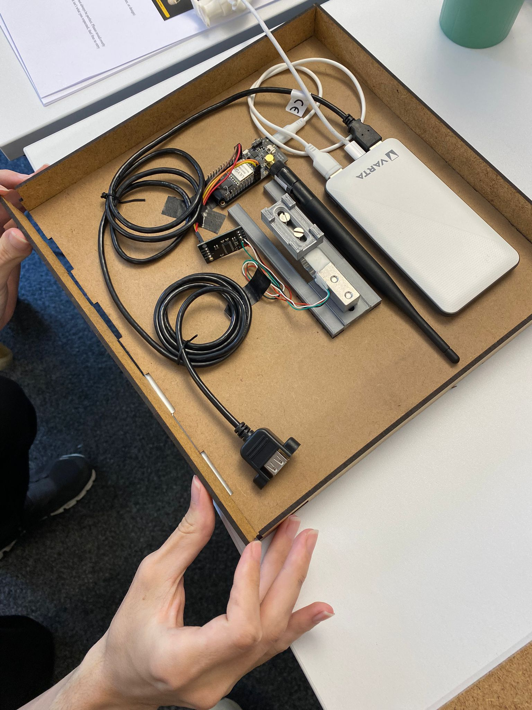

# TheBox
## Design and Specification

### Requirements

The goal of this project was to design a system that is able to detect when new parcels are deposited and notify the user upon detection that new mail has arrived. This type of system can be categorized as a non-critical system, as it does not cause any significant harm or major disruption if it were to fail.

With regard to the characteristics of the system, we aimed to design a solution that provides all the necessary functionality while emphasizing convenient usability for the end user. The reactivity of the system can be low as the real-time constraints are soft, meaning that a delayed response is acceptable. In terms of predictability, we strove to create a solution that performs consistently, allowing us to determine how the system will behave in relevant scenarios. Dependability, on the other hand, is not as crucial, thus a moderate level is acceptable. Another goal was to create a general\_purpose design suitable for most mailboxes. This aspect also ties into the system's efficiency, which should be optimized with usability in mind.

With these characteristics in mind, we created the following list of requirements.

#### List of Requirements
- **Non-Intrusive Operation:** Must not interfere with mail retrieval or the postman's ability to deposit letters and packages.
- **Weather Resistance:** Minor water exposure must not interrupt operation nor damage the device.
- **Durability:** Must withstand typical mailbox conditions, including door slams and parcels being placed on it.
- **Size Consideration:** The device must suit standard mailbox sizes without causing obstruction.
- **User-Friendly Installation:** Must be easy for consumers to install without risk of incorrect setup.
- **Detection Capability:** Must be equipped with a mechanism to detect the presence of parcels.
- **Notification Functionality:** Must be capable of triggering alerts or notifications.
- **Power Usage:** Should offer convenient reachability.
- **Environment Compatibility Consideration:** Must function within insulated spaces, including metal mailboxes and behind walls.
- **Simple Event Categorization:** Determines only whether new mail has arrived, without needing to identify specific objects.
- **Timely Presence Awareness:** Must reliably detect and communicate the arrival of new mail.
- **inimal Data Communication:** Requires only small data size and low transmission rate.
- **Self-Contained Architecture:** Should operate as an independent unit with the ability to connect to a central node.

### Specification

#### de\_box

de\_box is a system that can turn any residential mailbox into a smart mailbox. The system itself is made up of two elements: a sender module placed within the mailbox and a receiver module placed within the residence. The sender module contains all the necessary electronic sensors, battery, and microcontrollers to detect when a parcel has been placed in the mailbox. The sender module communicates to the receiver module when a parcel has been detected, which triggers a notification to be sent to the user.

#### Functional Requirements [specialization]

- **[Dependability]** Detects the mass of parcels and letters placed in the mailbox.
- **[Dependability]** Detects if additional mail has been placed in the mailbox.
- **[Reactivity]** Sender node communicates to receiver node when new mail is detected.
- **[Reactivity]** Triggers a notification being sent to the user when new mail is detected.

#### Non-functional Requirements

- **[Dependability]** Ensure sender module does not hinder operability of mailbox.
- **[Dependability]** Ensure sender module fits within standard mailbox.
- **[Dependability]** Ensure sender module is easy to install.
- **[Dependability]** Ensure signal can travel through metal casing of a mailbox and through building walls.
- **[Dependability]** Normal weather and environmental conditions should not impact functionality.
- **[Efficiency]** Provide convenient method to recharge sender module.
- **[Efficiency]** Sender module sends only small data packets and only upon detection of new mail placed in the mailbox.
- **[Predictability]** Detect only if the mass measured within the mailbox has increased.
- **[Real-Time Constraint]** Must notify user upon detection of new mail: $<$ 5 minutes (soft).

## Implementation

### System Overview

The above Figure shows an overview of all the components that make up our implementation. We distinguish between the sender module (components 1 and 2), which is placed in the letterbox and is battery-powered and the receiver module (component 3) and the backend (components 4 and 5), which in turn hosts a dashboard (components 6 and 7). All individual parts of our system are described in greater detail below.

### Sender Module
The sender module is the component that the user deploys into each compartment where letters or parcels are received. It was designed to be a self-contained unit to ensure easy deployability without any modification to the mailbox. The components of this module are situated within a flat enclosure that fills the width and height of a standard Swiss mailbox, while being as thin as possible to impose minimal height restrictions on the parcels received. Letters and parcels are detected through a load cell that is mechanically connected to the top cover of the module, effectively measuring the weight of the mailbox content. This choice of sensor has three benefits:
- **Easy Installation:** The load cell does not require precise installation. It could simply be integrated into the sender module, acting as a base plate for the mailbox detecting its content.
- **High Sensitivity:** The load cell provides a high detection accuracy as we determined it to be capable of reliably detecting a single sheet of A4 paper.
- **Proportional Measurement:** The load cell provides us with a weight measurement of the current mailbox content. This way, we can differentiate between parcels and letters. Furthermore, we can detect the arrival of additional content even if earlier content has not been removed.

The sender module consists of three core components: the load cell, microcontroller with LoRa sender, and power source. The load cell component is further subdivided into the sensor and driver board. The architecture of these components is depicted in the above Figure.

The sender module was implemented by first creating a 3D model of the enclosure and mounts for the sensing device in Autodesk Fusion 360, depicted in the above Figure. The latter provided a connection of the enclosure's lid to its base through the load cell, which is depicted in the Figure below.

The outer shell of the box was converted to paths for a laser cutter and cut out of 3mm MDF plates. These plates make up the outer shell of the product and protect the components from the environment. The inside of the sender module is depicted in the Figure below.

Finally, we added a USB port to the outside of the case to facilitate charging of the device. For applications requiring heavy parcels, the hardware design also supports mounting a load cell that measures up to 20kg.

To achieve low energy consumption, this module only wakes up once every 5 minutes. When this happens, 10 weight measurements are collected and averaged. The module holds an internal state of the last measurement and then decides, based on a weight threshold, if the new measurement indicated a new delivery. Only if this is the case is the radio activated and a packet sent.

### Receiver Module
The receiver module is similar to the sender module, apart from the fact that it does not need a load cell and is not battery-powered. It features a LoRa module that listens to incoming LoRa packages. It is wired to a Raspberry Pi in order to forward received messages to the Pi via UART. For the receiver module, no energy-saving considerations have been made since this will be located in the home and can be plugged in around the clock. As the underlying chip is already energy-efficient, we deemed that there is no need for a custom efficiency solution.

### Backend
A Raspberry Pi serves as the core component of the backend. It is wired to the LoRa receiver, which forwards incoming packets to it via UART. The Pi runs a Python script as a daemon that listens for communication with the LoRa module. If messages are received, they are parsed and stored in a SQLite database. We chose SQLite for its efficiency and simplicity. Its lightweight nature makes it perfect for a constrained device like the Pi. The Pi also has Python code to create sample data that is stored in the database. This can be used for manual testing and to ensure that the dashboard can display a rich history of past deliveries. There are two Python files to do this. data\_generator.py generates multiple hypothetical deliveries spread out over the last 14 days, whereas single\_sample\_data.py can be used to create a specific single delivery, where all delivery details can be specified as sysargs. The Paspberry Pi also hosts the Grafana dashboard. Both the Grafana client and the SQLite client run as daemons, which will ensure that they will always be restarted if the Pi might be plugged out or in case of a power outage happens. Since the Pi will also be situated in the home and is also energy'efficient, the same considerations as in the receiver module apply.

### Dashboard
Our system was designed for the backend to handle multiple sender modules. These report to the backend if they received letters or parcels and include the weight of the delivery in LoRa packets sent. The backend displays a dashboard on which the user can view their registered sender modules and view statistics of the arrivals. We decided to use Grafana for our dashboard solution, which is hosted on the Pi. Grafana directly queries the SQLite database and aggregates this data in several ways. We decided to make different ways of visualizing delivery history (like distribution by weekday or by time of the day), and we also implemented a pseudo-component that shows all smart letterboxes of this user on a map with their corresponding status. If a new delivery is recognized by the dashboard, it forwards this information to a Telegram bot which in turn can be incorporated in different ways. This bot ensures the user is notified of new deliveries.

